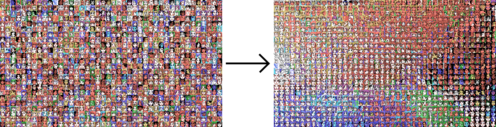

# ImageRearranger Jupyter Notebook

*Rearranges a grid of images into a mosaic according to their similarity.*

* **Imports** a single image containing disordered tiles.
* **Exports** a single image containing ordered tiles. 

*Credits:*

* Based on Kyle McDonald's [ImageRearranger](https://github.com/kylemcdonald/ImageRearranger/tree/master?tab=readme-ov-file).
* Includes code from Kyle McDonald's [python-utils](https://github.com/kylemcdonald/python-utils) repository. 
* Inspired by [this collection](https://twitter.com/JUSTIN_CYR/status/829196024631681024) of pixel art by Justin Cyr.

---

## 1. Download the *ImageRearranger* repository

* Download repository (click on green "Code" button, select "Download"); unzip to `ImageRearranger/`
* `cd ImageRearranger`
* Create a virtual environment, "mosaicVenv":
  * Mac: `python3 -m venv mosaicVenv`
  * Win: `python -m venv mosaicVenv`
* Activate the `mosaicVenv` virtual environment:
  * Mac: `source mosaicVenv/bin/activate`
  * Win: `mosaicVenv\Scripts\activate`

---

## 2. Install necessary libraries

If you haven't already done so, 

* Upgrade `pip` (optional, but recommended): 
  * `pip install --upgrade pip`
* Install all required packages (into `mosaicVenv`)
  * `pip install -r requirements.txt`
* This should only need to be done once; you won't need to re-install libraries the next time you activate the virtual environment.

Note that we will be installing the libraries in `requirements.txt`, which are as follows: 

* numpy
* scipy
* scikit-learn
* Pillow
* jupyter
* matplotlib
* opencv-python
* scikit-image
* umap-learn
* git+https://github.com/gatagat/lap.git

---

## 3. Launch Notebook 

* Launch Jupyter Notebook:
  * `jupyter notebook`
* This will open `http://localhost:8888/tree`
* From there, open `http://localhost:8888/notebooks/ImageRearranger.ipynb`
* Step through the notebook!
